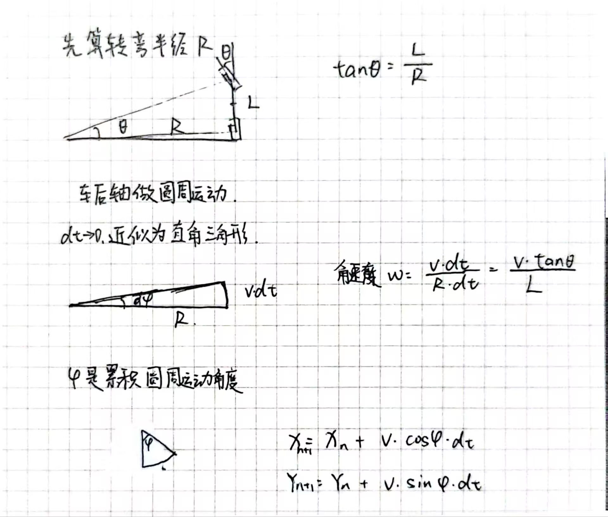
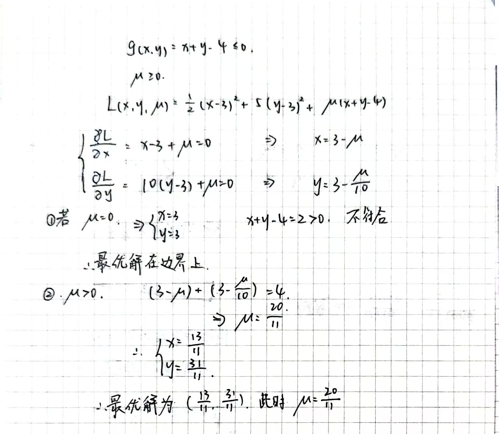

# 最优化与控制

## 迟交原因

前面两周在备赛智能物流的工创赛校赛，6月14号比赛。我做的视觉，我们组进度被电控坑挺惨，最后结果非常不理想（但是结果不理想不是电控导致的，很冤）。现在那边的情况是我们队校赛被淘汰了，今年没有后续任务了。。

## 作业一

### bicycle

这个部分学长的录播课里面讲的足够清晰了，我贴个图，算记个笔记（）

这个扩展的部分我尝试了快两个小时没看明白，属于是有点为难我这个英语和物理都不算出色的同学了，以后有空再研究（）但是我让gemini给我生成了全部的代码。我很困惑为什么会显示出来最终完整圆的半径比运动学计算出来的还小。我问ai问了半天最后得出的结论是小车大概率是转向过度漂起来了（）

### lane_follower

针对这个题目，我觉得最好用的应该就是纯跟踪算法了。路径是重复且有规律的，当小车几乎与规划线重合以后再使用pid控制效果大抵不佳。

纯跟踪算法是找到距离当前车辆 **前方固定距离（前视距离）** 的理想轨迹上的点，然后走一段圆弧过去。

此处是前方固定距离，而不是最近距离。一开始我弄错了，写出来的路线瞎跑。。。

纯跟踪算法的实现：

1. 设定纯跟踪算法的超参数前视距Ld，与车速正相关。

2. 在参考轨迹中找到一个距离当前车辆位置最近且距离大约为Ld的点。

3. 带入公式，前轮转角$\sigma = \arctan\left(\frac{2 \cdot L \cdot \sin(\alpha)}{L_d}\right)$

4. 更新车辆状态。

我系统主题颜色的暗色，我把参考轨迹线改成白的了，要不然看不见（）

理想状态下效果还行。

然后我也是纯ai无人工的生成了一份pid的代码看看效果，果然是画龙了。

## 作业二

### Eigen库介绍(来自deepseek)

Eigen是一个开源的C++模板库，专门用于线性代数计算，它为处理向量、矩阵和相关数值算法提供了全面而高效的工具。

自2006年首次发布以来，Eigen因其出色的性能和易用性，已成为科学计算、机器学习、图形学、金融工程等领域中广泛使用的标准库。例如，谷歌的TensorFlow机器学习框架和CERN（欧洲核子研究组织）的多个项目都在使用Eigen。

nnd 搞了半天才把eigen库的路径写进code runner的配置。

### Q1

这个纯考验语法来的，然后尝试调这个超参数。

| eta | 迭代次数 |
| --- | --- |
| 0.1 | 76 |
| 0.15 | 50 |
| 0.16 | 46 |
| 0.17 | 43 |
| 0.18 | 41 |
| 0.19 | 76 |

### Q2

咋给我复习上高数了

### Q3

至今没有解决OSQP库的问题，代码每次都是头文件报错，deepseek给我看力竭了，很烦。。。

后面有空再解决吧，现在要准备答辩的东西了。。。

哦 我傻了，现在才想起来可以用CMake解决（
