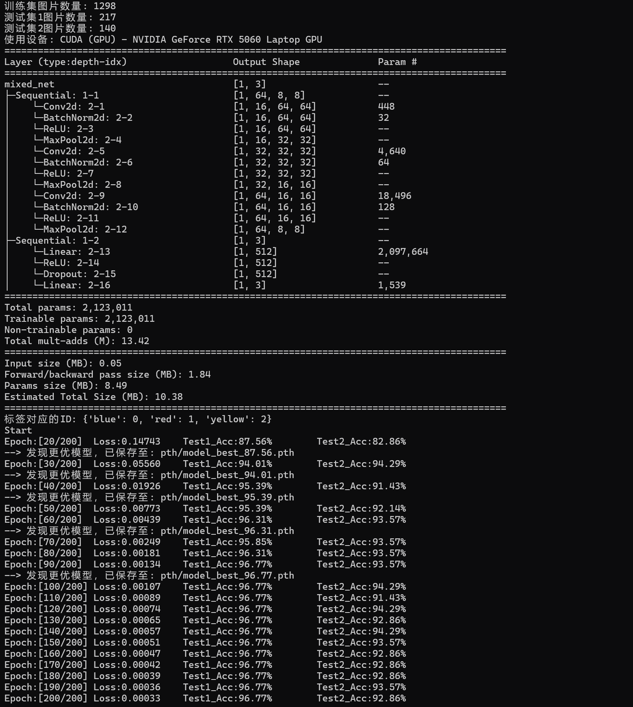
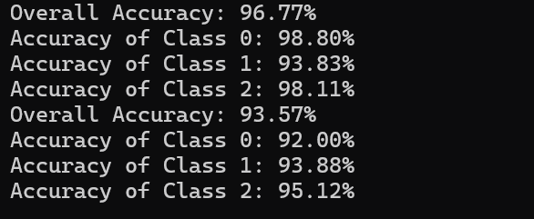

# 深度学习

## 1. 学习卷积神经网络全过程

直播课上学长讲的我实话我没太听懂，之后我看了几篇博客，最后找到了一篇通俗易懂一点的->[卷积神经网络（CNN）详细介绍及其原理详解](https://ironmanjay.blog.csdn.net/article/details/128689946?fromshare=blogdetail&sharetype=blogdetail&sharerId=128689946&sharerefer=PC&sharesource=R_A_M_U_D_A&sharefrom=from_link)。这篇博客以手写数字识别和人脸识别为例，介绍了卷积神经网络的原理和流程，我读完之后觉得非常通透，对学长课上讲的概念也瞬间理解了。

## 2. 阅读代码

之后我就来阅读net.py和test.py两个代码了。net.py中定义了网络结构，并训练模型，test则是测试模型。关于构建网络我自己从0开始手写必是无从下手的，我找到了去年暑假的工科培训发的代码。当时学长只是让我们在网上自己找图片制成数据集训练模型，然后优化代码，没有让我们自己构建网络（好像是吧）。然后这次我重新看了构建网络部分的代码，大致是看懂了（没看懂的问ai了）。

另外在看net代码的时候我发现有个小问题，max_correct写循环里面了，并且初始值设置的是99，如果我没理解错的话应该是写外面并设为0才对，已严肃修改。

## 3. 写代码

我按照卷积神经网络流程构建了网络结构，反向传播算法部分的代码在原来的代码里有，我用注释标出来了。

中途我有一个疑惑，前期学习的时候我感觉卷积核似乎是一个非常重要的参数，但是我的代码里似乎没有定义卷积核，这个我看到有说法说最开始卷积核是随机的，后面再通过反向传播进行调整优化，以减小loss。发现传播更新的参数包括全连接层的一些东西。

当时在一篇博客里看到有用 `nn.Dropout(0.5)` 做正则化，反正我直觉这个东西很随意，不是很理解也不是很喜欢，替换成了卷积层类似的 `nn.BatchNorm1d(512),`。任何我就那这个问题问ai，得到的回复是`Dropout`的正则化效果更好，并且抗干扰能力更强，最终还是妥协了。

## 4. 训练模型并测试

环境这块没有遇到问题，之前配好了。就是不知道为啥VScode没法给我直接运行代码，我只能在终端运行。

遇到了一些问题，训练模型的时候GPU占用率竟然是0。修改了`DataLoader`部分的参数，把`num_workers`设置成4，GPU利用率是上来了但是内存似乎有点爆炸了。。。

顺利跑完了，就是有点慢呢（

### 训练过程

### 测试结果

---

## 5. 深入研究的概念

### 1. 激活函数

学长给的这个博客写挺好，感觉挺详细->[深度学习中常见的10种激活函数（Activation Function）总结](https://blog.csdn.net/qq_42691298/article/details/126590726?fromshare=blogdetail&sharetype=blogdetail&sharerId=126590726&sharerefer=PC&sharesource=R_A_M_U_D_A&sharefrom=from_link) 我在此就整理了一些对我写代码起到很大帮助的部分内容。

#### 激励函数的用途

> 1. 对于y=ax+b 这样的函数，当x的输入很大时，y的输出也是无限大小的，经过多层网络叠加后，值更加膨胀的没边了，这显然不符合我们的预期，很多情况下我们希望的输出是一个概率。
> 2. 线性的表达能力太有限了:  如果不用激励函数（其实相当于激励函数是f(x) = x），在这种情况下你每一层节点的输入都是上层输出的线性函数，很容易验证，即使经过多层网络的叠加，输出都是输入的线性组合，与没有隐藏层效果相当，这种情况就是最原始的感知机（Perceptron）了，那么网络的逼近能力就相当有限。

按我的理解，激励函数的作用就像哈希函数一样，将输入映射到输出空间，引入一些非线性的算法可以表达原始数据更多的信息。

#### 常见激活函数

这些学长上课讲了一些，当时是懵逼的，现在对卷积神经网络整体有了更深入的学习之后再看博客就懂了。

我在代码里使用的就是最简单的`ReLU`，虽然我很想尝试`Leaky ReLU`和`ELU`，但是这个$\alpha$值不能学习，我尝试了几次效果很差，就放弃了，感觉是需要一些经验值之类的。

然后文中还提到了`Sigmoid`，但是同时也提到该函数只有在更深的网络层使用才能体现其优势，以及它的改进函数`hard-Swish`和`Mish`，但是他们计算复杂度又比较高，在彻底弄懂其他部分对运行效率的影响之前，我不打算尝试（

### 2. DataLoader中各项参数

想到这个是之前跑YOLOv5的时候差点把电脑卡死了，所以想查一下这些参数是怎么影响训练效率的。

#### 1. dataset

要加载的数据集对象，`Dataset`实例

#### 2. batch_size

每个`batch`包含的样本数量，决定模型每次迭代看到的数据量，取决于GPU内存。但是这个值太小会影响训练效果，会导致模型更关注数据之间的相关性。

#### 3. shuffle

默认`False`，每个`epoch`是否打乱数据顺序，防止模型记住数据顺序，提高泛化能力。

#### 4. num_workers

默认0，用于数据加载的子进程数量，提高数据加载速度。

通常设置为CPU核心的一半，反正电脑撑得住就往多了写（）

#### 5. sampler

默认`None`，指定数据集的采样方式，如`RandomSampler`、`SequentialSampler`、`WeightedRandomSampler`等，不能与`shuffle`一起使用。

#### 6. batch_sampler

完全控制每个 batch 中应该包含哪些样本，而不是简单地按顺序或随机取连续的一批数据。（没看出来有什么用）

#### 7. pin_memory

默认`False`，是否将数据加载到GPU内存中，如果数据集较大，可以设置为`True`，但需要保证GPU内存充足。

#### 8.  prefetch_factor

每个子进程的预取数量，默认为2，仅当`num_workers > 0`时有效。预取数据，减少等待时间。

#### 9. persistent_workers

是否在`epoch`之间保持`worker`进程存活，避免每个`epoch`重启`worker`的开销，同样仅当`num_workers > 0`时有效。

#### 10. collate_fn

自定义函数，用于将样本列表合并成`batch`，泳衣应对样本大小不一致的情况。

#### 11. drop_last

默认`False`，是否丢弃最后一个不完整的`batch`，如果数据集大小不能被`batch_size`整除，则最后一个`batch`将小于`batch_size`。

* 场景：

* True：适合需要固定`batch`大小的训练（如`BatchNorm`）

* False：保留所有数据（适合验证/测试）

#### 12. timeout

默认0，从`worker`获取`batch`的超时时间（秒），仅当`num_workers > 0`时有效。

#### 13. worker_init_fn

每个`worker`进程初始化时调用的函数，设置随机种子、初始化资源等。
